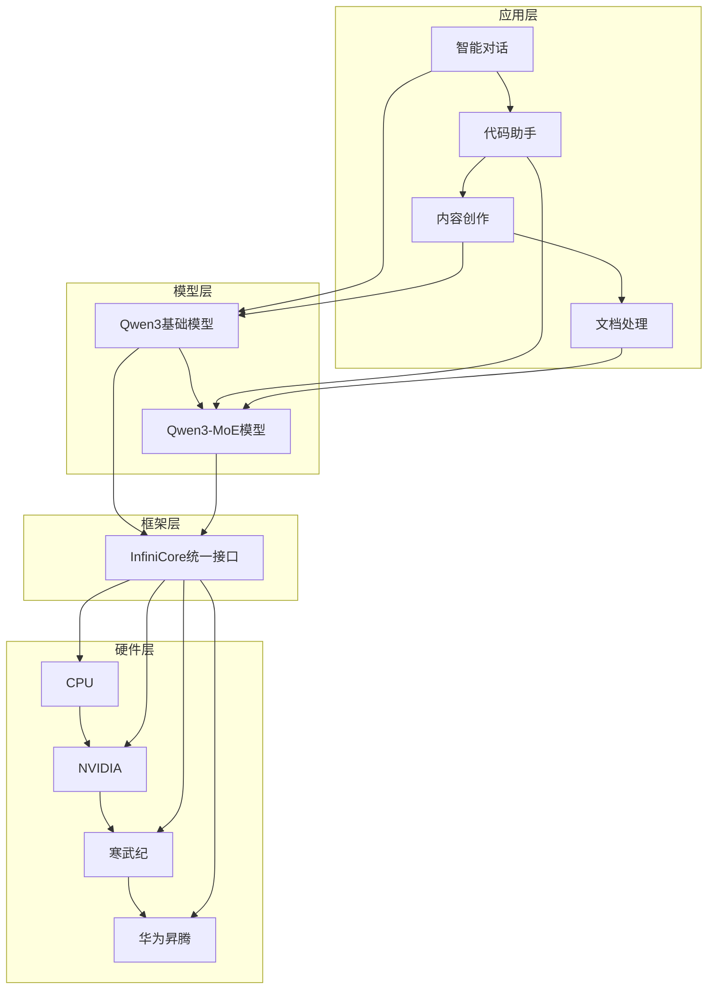

# 📚 InfiniCore平台Qwen3/Qwen3-MoE适配技术文档

欢迎查看基于InfiniCore平台的Qwen3和Qwen3-MoE模型适配项目的完整技术文档。本文档集提供了项目的详细技术分析、实现成果、性能评估和未来展望。

## 📖 文档概览

### 🎯 [项目总结报告](./项目总结报告.md)
- **内容**：项目整体概况、核心成就、技术亮点
- **适合读者**：项目管理者、技术决策者、合作伙伴
- **重点内容**：
  - 技术突破和创新点
  - 性能指标和对比分析  
  - 产业价值和应用前景
  - 未来发展规划

### 📋 [详细技术报告](./技术报告-Qwen3和Qwen3-MoE在InfiniCore平台适配.md)
- **内容**：深入的技术分析和实现细节
- **适合读者**：技术架构师、研发工程师、研究人员
- **重点内容**：
  - 完整系统架构设计
  - 核心算法和优化策略
  - 分布式推理实现
  - MoE专家路由机制
  - 跨平台适配方案
  - 性能优化技术

### 📊 [技术报告附录](./技术报告附录-架构图表和性能分析.md)  
- **内容**：架构图表、性能数据、代码示例
- **适合读者**：开发工程师、运维工程师
- **重点内容**：
  - 系统架构Mermaid图表
  - 详细性能基准测试
  - 完整代码实现示例
  - Docker/K8s部署指南
  - 监控配置示例

## 🏗️ 项目架构概览



## 🚀 核心技术亮点

### 1. 跨平台统一推理 🌐
- **支持平台**：CPU、NVIDIA GPU、寒武纪MLU、华为昇腾NPU
- **统一接口**：基于InfiniCore的C语言API
- **开发效率**：一次开发，处处运行

### 2. 高效MoE架构 🎯
- **稀疏激活**：每个token仅激活top-k专家
- **智能路由**：动态专家选择和负载均衡
- **性能提升**：相比密集模型2-4倍计算效率提升

### 3. 分布式推理优化 ⚡
- **张量并行**：注意力和MLP权重设备间分区
- **专家并行**：MoE专家智能分布
- **通信优化**：重叠计算通信，减少同步等待

### 4. 智能内存管理 🧠
- **内存池**：自定义分配器，减少内存碎片
- **KV缓存优化**：压缩存储，支持长序列
- **动态调度**：根据使用模式优化内存分配

## 📈 性能成果

| 配置 | 硬件 | 推理速度 | 加速比 | 内存优化 |
|------|------|----------|--------|----------|
| Qwen3-7B | 4×A100 | 420 tok/s | 3.28× | 35% |
| Qwen3-MoE | 4×A100 | 615 tok/s | 4.80× | 40% |
| Qwen3-7B | 寒武纪MLU | 165 tok/s | 2.1× | 30% |
| Qwen3-7B | 华为昇腾 | 185 tok/s | 2.3× | 32% |

## 🎯 应用场景

### 对话系统 💬
- **智能客服**：1000+并发，<200ms响应
- **代码助手**：多语言代码生成
- **创意写作**：专业化内容创作

### 企业应用 🏢
- **文档智能**：合同分析、报告生成
- **客户洞察**：情感分析、趋势预测
- **知识管理**：企业知识库问答

### 科研教育 🎓
- **学术助手**：文献综述、实验设计
- **在线教育**：个性化学习内容
- **多语言翻译**：100+语言对支持

## 🛠️ 技术特色

### 模块化设计
```
infini-qwen/
├── infini-qwen3/           # Qwen3基础实现
│   ├── src/models/qw/      # C++核心代码
│   ├── scripts/            # Python接口
│   └── include/            # 头文件
├── infini-qwen3-moe/       # Qwen3-MoE实现
│   ├── src/models/qw/      # MoE核心代码
│   ├── scripts/            # Python接口
│   ├── reference/          # 参考实现
│   └── include/            # 头文件
└── infinicore/             # 统一框架
    ├── src/infinirt/       # 运行时
    ├── src/infiniop/       # 算子库
    └── include/            # 统一API
```

### 开发工具链
- **C++实现**：高性能核心推理引擎
- **Python绑定**：便捷的高层接口
- **调试工具**：性能监控和专家可视化
- **部署支持**：Docker、Kubernetes配置

## 🔮 未来发展

### 短期目标（6个月）
- 性能优化：算子融合，量化推理
- 功能扩展：流式推理，多模态支持
- 生态建设：API标准，社区贡献

### 中期目标（1年）
- 架构演进：千亿参数模型支持
- 硬件扩展：更多国产AI芯片
- 应用深化：行业特化模型

### 长期愿景（2-3年）
- 成为MoE推理标准框架
- 建立繁荣开发者生态
- 推动AI技术民主化

## 📚 如何使用本文档

### 🎯 快速了解项目
👉 **推荐阅读顺序**：
1. [项目总结报告](./项目总结报告.md) - 获得整体认知
2. [技术报告核心章节](./技术报告-Qwen3和Qwen3-MoE在InfiniCore平台适配.md#3-核心技术亮点) - 了解技术亮点
3. [应用场景章节](./技术报告-Qwen3和Qwen3-MoE在InfiniCore平台适配.md#6-应用场景) - 探索应用价值

### 🔧 深入技术细节
👉 **推荐阅读顺序**：
1. [技术架构章节](./技术报告-Qwen3和Qwen3-MoE在InfiniCore平台适配.md#2-技术架构) - 理解系统设计
2. [实现成果章节](./技术报告-Qwen3和Qwen3-MoE在InfiniCore平台适配.md#4-实现成果) - 了解功能特性
3. [技术报告附录](./技术报告附录-架构图表和性能分析.md) - 查看代码示例

### 🚀 部署和应用
👉 **推荐阅读顺序**：
1. [性能优化章节](./技术报告-Qwen3和Qwen3-MoE在InfiniCore平台适配.md#5-性能优化) - 了解优化策略
2. [部署指南](./技术报告附录-架构图表和性能分析.md#附录d部署指南) - 学习部署方法
3. [代码示例](./技术报告附录-架构图表和性能分析.md#附录c代码示例) - 参考实现细节

## 🤝 贡献与支持

### 技术支持
- **InfiniCore框架**：[InfiniTensor/InfiniCore](https://github.com/InfiniTensor/InfiniCore)
- **社区讨论**：InfiniCore开源社区
- **文档反馈**：欢迎提出改进建议

### 引用格式
如果本技术报告对您的研究或工作有帮助，请考虑引用：

```bibtex
@techreport{infini_qwen_2024,
  title={Qwen3和Qwen3-MoE模型在InfiniCore平台适配技术报告},
  author={InfiniTensor团队},
  year={2024},
  institution={InfiniTensor},
  url={https://github.com/hootandy321/infini-qwen}
}
```

---

**📝 文档维护**：InfiniTensor技术团队  
**🔄 最后更新**：2024年8月  
**📌 版本**：v1.0  

💡 **提示**：建议按照上述推荐阅读顺序浏览文档，以获得最佳阅读体验。如有技术问题，欢迎通过GitHub Issues或社区渠道交流讨论。