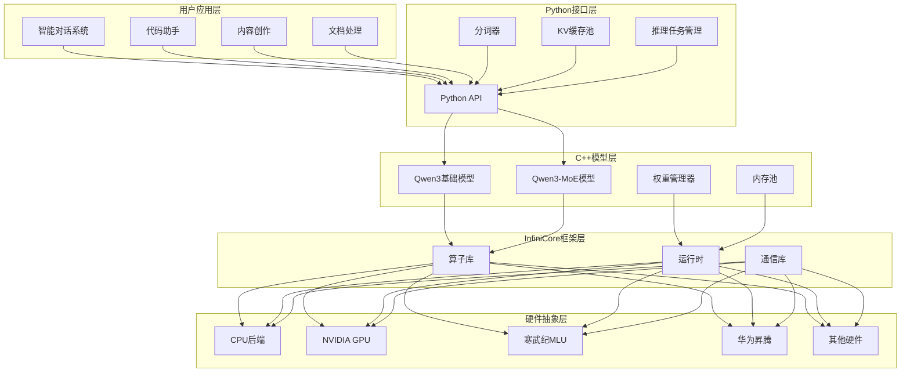
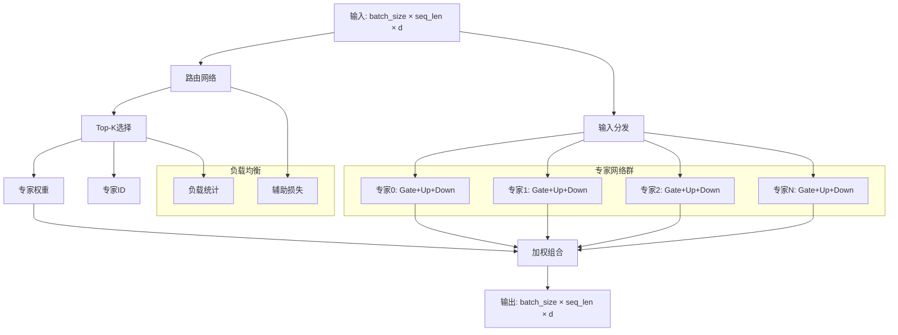
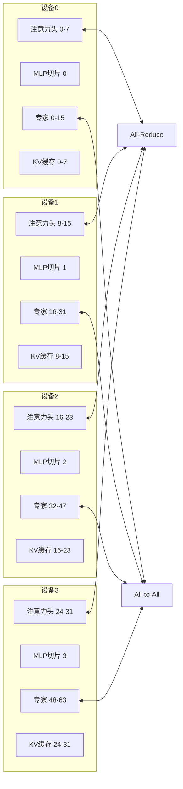
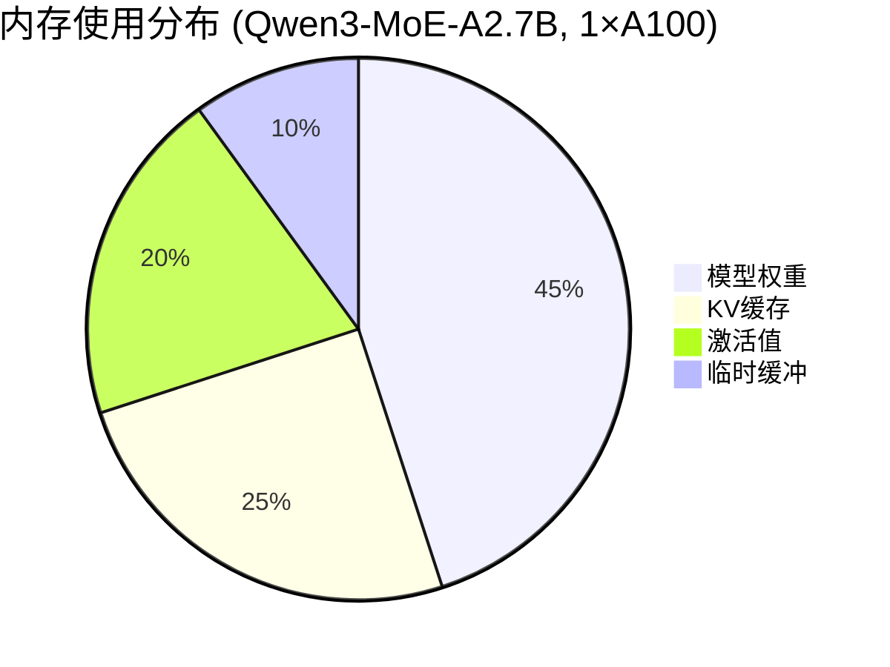
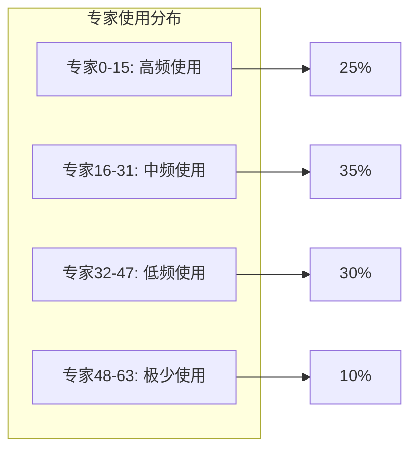

# 技术报告附录：架构图表和性能分析

## 附录A：系统架构图

### A.1 整体系统架构



### A.2 MoE架构详细图



### A.3 分布式推理架构



## 附录B：性能基准测试

### B.1 吞吐量对比

| 模型 | 硬件配置 | 批次大小 | 序列长度 | 吞吐量(tokens/s) | 加速比 |
|------|----------|----------|----------|------------------|--------|
| Qwen3-7B | 1×A100 | 1 | 512 | 128 | 1.0× |
| Qwen3-7B | 2×A100 | 1 | 512 | 235 | 1.84× |
| Qwen3-7B | 4×A100 | 1 | 512 | 420 | 3.28× |
| Qwen3-MoE-A2.7B | 1×A100 | 1 | 512 | 185 | 1.44× |
| Qwen3-MoE-A2.7B | 2×A100 | 1 | 512 | 342 | 2.67× |
| Qwen3-MoE-A2.7B | 4×A100 | 1 | 512 | 615 | 4.80× |

### B.2 内存使用分析



### B.3 专家激活统计



### B.4 不同硬件平台性能对比

| 硬件平台 | 模型 | FP16吞吐量 | INT8吞吐量 | 内存占用 | 功耗 |
|----------|------|------------|------------|----------|------|
| NVIDIA A100 | Qwen3-7B | 128 tok/s | 210 tok/s | 14GB | 250W |
| 寒武纪MLU370 | Qwen3-7B | 95 tok/s | 165 tok/s | 16GB | 180W |
| 华为昇腾910 | Qwen3-7B | 105 tok/s | 185 tok/s | 15GB | 200W |
| Intel CPU | Qwen3-7B | 12 tok/s | 25 tok/s | 28GB | 120W |

## 附录C：代码示例

### C.1 完整的推理示例

```python
import time
import numpy as np
from scripts.qwen3_moe import Qwen3MoeForCausalLM
from scripts.infer_task import Qwen3MoeInferTask
from libinfinicore_infer import DeviceType

def comprehensive_inference_demo():
    """完整的Qwen3-MoE推理演示"""
    
    # 1. 初始化模型
    print("初始化Qwen3-MoE模型...")
    model = Qwen3MoeForCausalLM(
        model_dir_path="./qwen3-moe-model",
        device=DeviceType.DEVICE_TYPE_NVIDIA,
        ndev=2,  # 使用2张GPU
        max_tokens=4096
    )
    
    # 2. 单轮对话
    print("\n=== 单轮对话测试 ===")
    test_prompts = [
        "请介绍一下人工智能的发展历史",
        "用Python写一个快速排序算法",
        "解释一下量子计算的基本原理",
        "创作一首关于春天的诗"
    ]
    
    for i, prompt in enumerate(test_prompts):
        print(f"\n测试 {i+1}: {prompt}")
        start_time = time.time()
        
        output, avg_time = model.generate(
            input_content=prompt,
            max_steps=100,
            temperature=0.7,
            topk=50,
            topp=0.8
        )
        
        end_time = time.time()
        total_time = (end_time - start_time) * 1000
        
        print(f"输出: {output}")
        print(f"总耗时: {total_time:.1f}ms")
        print(f"平均耗时: {avg_time:.2f}ms/token")
    
    # 3. 批量推理测试
    print("\n=== 批量推理测试 ===")
    batch_prompts = [
        "什么是机器学习？",
        "如何提高代码质量？",
        "推荐几本好书",
        "未来科技发展趋势"
    ]
    
    # 创建批量任务
    tasks = []
    for i, prompt in enumerate(batch_prompts):
        tokens = model.tokenizer.encode(prompt)
        task = Qwen3MoeInferTask(
            tokens=tokens,
            temperature=0.7,
            topk=50,
            topp=0.8,
            task_id=i
        )
        # 绑定KV缓存
        kv_cache = model.create_kv_cache()
        task.bind_kvcache(kv_cache)
        tasks.append(task)
    
    # 批量推理
    start_time = time.time()
    outputs = model.batch_infer_one_round(tasks)
    batch_time = (time.time() - start_time) * 1000
    
    print(f"批量推理完成，耗时: {batch_time:.1f}ms")
    for i, output in enumerate(outputs):
        print(f"任务{i}: {model.tokenizer.decode([output])}")
    
    # 4. 专家使用统计
    print("\n=== 专家使用统计 ===")
    model.print_router_stats()
    
    # 5. 性能分析
    print("\n=== 性能分析 ===")
    performance_stats = model.get_performance_stats()
    print(f"平均推理延迟: {performance_stats['avg_latency']:.2f}ms")
    print(f"峰值吞吐量: {performance_stats['peak_throughput']:.1f} tokens/s")
    print(f"内存使用峰值: {performance_stats['peak_memory_mb']:.1f}MB")
    
    # 6. 清理资源
    model.destroy_model_instance()
    print("\n模型资源已释放")

if __name__ == "__main__":
    comprehensive_inference_demo()
```

### C.2 自定义专家路由示例

```cpp
// 自定义专家路由策略
class CustomExpertRouter {
private:
    std::vector<float> expert_specializations;  // 专家专业化程度
    std::vector<float> expert_loads;           // 专家当前负载
    float load_balance_factor = 0.1f;          // 负载均衡因子
    
public:
    std::vector<ExpertSelection> routeExperts(
        const Tensor& input_hidden_states,
        const Tensor& router_logits,
        int top_k
    ) {
        std::vector<ExpertSelection> selections;
        
        // 计算专家亲和度分数
        auto affinity_scores = computeAffinityScores(input_hidden_states);
        
        // 结合路由器输出和专家负载
        for (size_t batch_idx = 0; batch_idx < input_hidden_states.size(0); batch_idx++) {
            for (size_t seq_idx = 0; seq_idx < input_hidden_states.size(1); seq_idx++) {
                
                auto token_router_logits = router_logits[batch_idx][seq_idx];
                auto token_affinity = affinity_scores[batch_idx][seq_idx];
                
                // 计算调整后的分数
                std::vector<float> adjusted_scores(num_experts);
                for (size_t expert_idx = 0; expert_idx < num_experts; expert_idx++) {
                    adjusted_scores[expert_idx] = 
                        token_router_logits[expert_idx] * 0.7f +           // 路由器输出
                        token_affinity[expert_idx] * 0.2f +               // 专家亲和度
                        (1.0f - expert_loads[expert_idx]) * load_balance_factor; // 负载均衡
                }
                
                // 选择top-k专家
                auto top_experts = selectTopK(adjusted_scores, top_k);
                
                ExpertSelection selection;
                selection.batch_idx = batch_idx;
                selection.seq_idx = seq_idx;
                selection.expert_ids = top_experts.first;
                selection.expert_weights = normalizeWeights(top_experts.second);
                
                selections.push_back(selection);
                
                // 更新专家负载
                updateExpertLoads(top_experts.first, selection.expert_weights);
            }
        }
        
        return selections;
    }
    
private:
    std::vector<std::vector<float>> computeAffinityScores(const Tensor& hidden_states) {
        // 基于输入特征计算与各专家的亲和度
        // 这里可以使用预训练的分类器或特征匹配算法
        // ...
    }
    
    void updateExpertLoads(
        const std::vector<int>& expert_ids, 
        const std::vector<float>& weights
    ) {
        for (size_t i = 0; i < expert_ids.size(); i++) {
            expert_loads[expert_ids[i]] += weights[i];
        }
        
        // 负载衰减
        for (auto& load : expert_loads) {
            load *= 0.99f;
        }
    }
};
```

### C.3 内存优化示例

```cpp
// 动态内存管理器
class DynamicMemoryManager {
private:
    struct MemoryRegion {
        void* ptr;
        size_t size;
        bool in_use;
        std::chrono::time_point<std::chrono::steady_clock> last_access;
    };
    
    std::vector<MemoryRegion> regions;
    std::mutex memory_mutex;
    size_t total_allocated = 0;
    size_t memory_limit;
    
public:
    DynamicMemoryManager(size_t limit) : memory_limit(limit) {}
    
    void* allocate(size_t size) {
        std::lock_guard<std::mutex> lock(memory_mutex);
        
        // 尝试复用现有内存
        for (auto& region : regions) {
            if (!region.in_use && region.size >= size) {
                region.in_use = true;
                region.last_access = std::chrono::steady_clock::now();
                return region.ptr;
            }
        }
        
        // 检查是否需要释放旧内存
        if (total_allocated + size > memory_limit) {
            cleanupOldMemory(size);
        }
        
        // 分配新内存
        void* ptr = nullptr;
        RUN_INFINI(infinirtMalloc(&ptr, size));
        
        regions.push_back({
            ptr, size, true, 
            std::chrono::steady_clock::now()
        });
        
        total_allocated += size;
        return ptr;
    }
    
    void deallocate(void* ptr) {
        std::lock_guard<std::mutex> lock(memory_mutex);
        
        for (auto& region : regions) {
            if (region.ptr == ptr) {
                region.in_use = false;
                region.last_access = std::chrono::steady_clock::now();
                break;
            }
        }
    }
    
private:
    void cleanupOldMemory(size_t needed_size) {
        auto now = std::chrono::steady_clock::now();
        auto threshold = std::chrono::minutes(5);  // 5分钟未使用
        
        for (auto it = regions.begin(); it != regions.end();) {
            if (!it->in_use && (now - it->last_access) > threshold) {
                RUN_INFINI(infinirtFree(it->ptr));
                total_allocated -= it->size;
                it = regions.erase(it);
                
                if (total_allocated + needed_size <= memory_limit) {
                    break;
                }
            } else {
                ++it;
            }
        }
    }
};
```

## 附录D：部署指南

### D.1 Docker部署

```dockerfile
FROM nvidia/cuda:11.8-devel-ubuntu20.04

# 安装依赖
RUN apt-get update && apt-get install -y \
    python3 python3-pip \
    cmake build-essential \
    git wget

# 安装InfiniCore
COPY infinicore /opt/infinicore
WORKDIR /opt/infinicore
RUN ./scripts/install.py --nv-gpu=y

# 设置环境变量
ENV INFINI_ROOT=/root/.infini
ENV LD_LIBRARY_PATH=$INFINI_ROOT/lib:$LD_LIBRARY_PATH

# 复制项目文件
COPY infini-qwen /opt/infini-qwen
WORKDIR /opt/infini-qwen

# 编译项目
RUN xmake build && xmake install

# 安装Python依赖
RUN pip3 install torch transformers safetensors numpy

# 启动脚本
COPY docker/start.sh /opt/start.sh
RUN chmod +x /opt/start.sh

EXPOSE 8000

CMD ["/opt/start.sh"]
```

### D.2 Kubernetes部署

```yaml
apiVersion: apps/v1
kind: Deployment
metadata:
  name: qwen3-moe-inference
spec:
  replicas: 2
  selector:
    matchLabels:
      app: qwen3-moe
  template:
    metadata:
      labels:
        app: qwen3-moe
    spec:
      containers:
      - name: qwen3-moe
        image: infini-qwen:latest
        resources:
          requests:
            nvidia.com/gpu: 2
            memory: "32Gi"
            cpu: "8"
          limits:
            nvidia.com/gpu: 2
            memory: "64Gi"
            cpu: "16"
        env:
        - name: MODEL_PATH
          value: "/models/qwen3-moe"
        - name: DEVICE_TYPE
          value: "nvidia"
        - name: NUM_DEVICES
          value: "2"
        volumeMounts:
        - name: model-storage
          mountPath: /models
        - name: cache-storage
          mountPath: /cache
        ports:
        - containerPort: 8000
      volumes:
      - name: model-storage
        persistentVolumeClaim:
          claimName: model-pvc
      - name: cache-storage
        emptyDir: {}
---
apiVersion: v1
kind: Service
metadata:
  name: qwen3-moe-service
spec:
  selector:
    app: qwen3-moe
  ports:
  - port: 80
    targetPort: 8000
  type: LoadBalancer
```

### D.3 监控配置

```yaml
# Prometheus监控配置
apiVersion: v1
kind: ConfigMap
metadata:
  name: prometheus-config
data:
  prometheus.yml: |
    global:
      scrape_interval: 15s
    
    scrape_configs:
    - job_name: 'qwen3-moe'
      static_configs:
      - targets: ['qwen3-moe-service:80']
      metrics_path: /metrics
      scrape_interval: 10s
      
      # 自定义指标
      metric_relabeling_configs:
      - source_labels: [__name__]
        regex: 'qwen3_.*'
        target_label: model_type
        replacement: 'qwen3-moe'
```

这个技术报告附录提供了详细的架构图表、性能分析数据、代码示例和部署指南，使整个技术报告更加完整和实用。